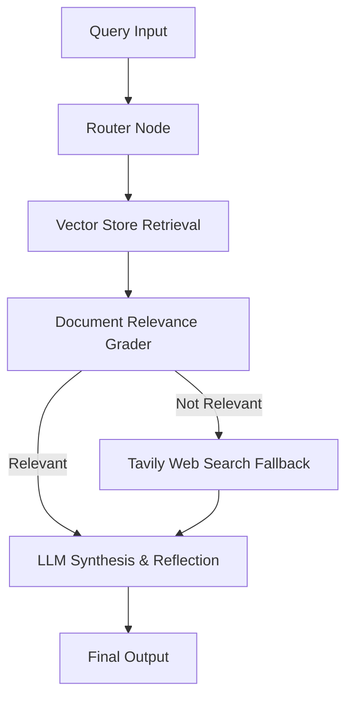

# 🧠 Autonomous Agentic RAG System (LangGraph + ReAct)

An advanced Agentic Retrieval-Augmented Generation (RAG) system built with LangGraph, ReAct framework, self-reflection, document relevance grading, and web search fallback.

## 🏗️ Architecture

